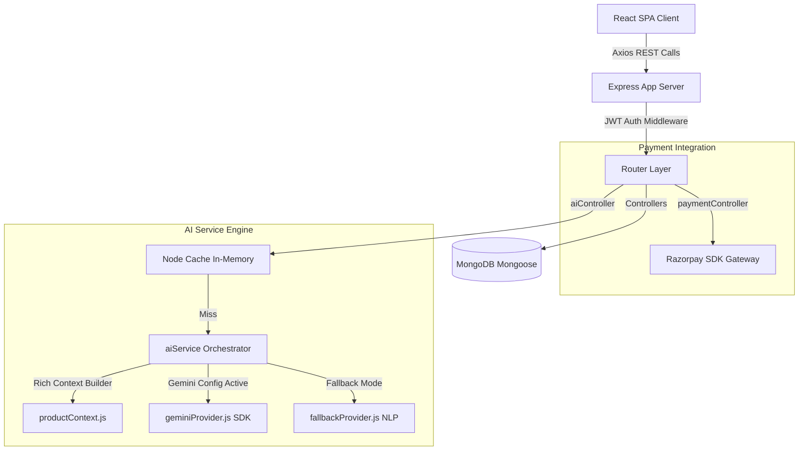
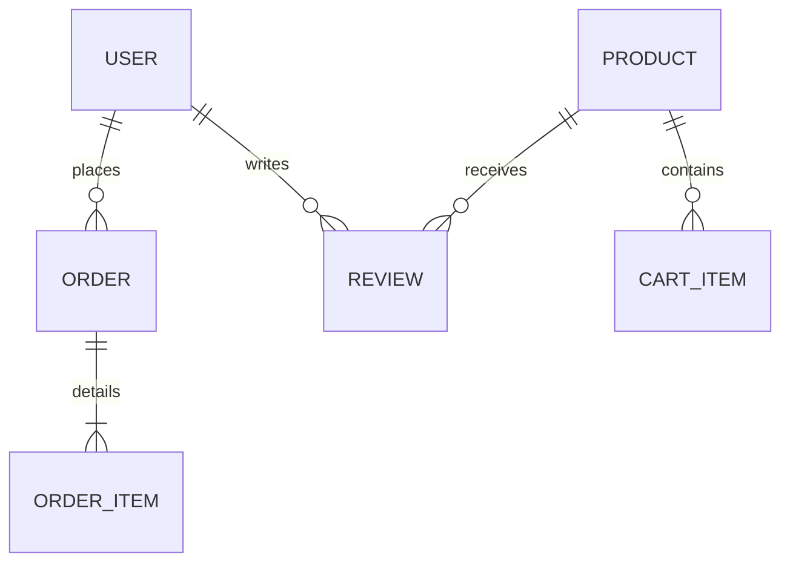

<div align="center">
  

  <h1>🛒 NextCart AI</h1>
  <p><strong>A Production-Grade, AI-Powered Full-Stack E-Commerce Platform</strong></p>

  [](https://next-cart-ai.vercel.app/)
  [](https://choosealicense.com/licenses/mit/)
  <br />
  
  [](https://react.dev/)
  [](https://tailwindcss.com/)
  [](https://nodejs.org/)
  [](https://expressjs.com/)
  [](https://www.mongodb.com/)
  [](https://deepmind.google/technologies/gemini/)
  [](https://razorpay.com/)
</div>

---

**NextCart AI** is a high-performance, developer-grade full-stack e-commerce application. It goes beyond the basic MERN template by implementing advanced features like **decoupled AI services (Google Gemini API with a robust fallback NLP engine)**, **stateless response caching**, **variant inventories**, **in-browser product comparisons**, and **secure third-party payment gateways with state checking**.

Designed specifically as a flagship portfolio project, NextCart AI demonstrates clean code architecture, database modeling, RESTful API design, and production hardening.

---

## 📸 Application Screenshots

| | |
|:---:|:---:|
|  |  |
|  |  |
|  |  |
|  |  |

---

## 📖 Table of Contents
- [Why I Built NextCart AI](#-why-i-built-nextcart-ai)
- [System Architecture](#-system-architecture)
- [Key Features](#-key-features)
- [Tech Stack](#-tech-stack)
- [Database Schema](#-database-schema)
- [API Documentation](#-api-documentation)
- [Engineering Decisions & Challenges](#-engineering-decisions--challenges)
- [Installation & Run Guide](#-installation--run-guide)
- [Environment Variables](#-environment-variables)
- [Future Roadmap](#-future-roadmap)

---

## 💡 Why I Built NextCart AI
Standard MERN projects often build simple, flat product catalogs and ignore real-world constraints. I built NextCart AI to tackle real production challenges:
1. **Managing complex product dimensions:** Creating a reusable multi-variant attributes structure (size, color, RAM) matching modern database designs.
2. **Handling payment failures gracefully:** Integrating a secure online payment flow (Razorpay) that supports secure token verification and order-level payment retries.
3. **Integrating AI efficiently:** Building an LLM assistant layer that utilizes caching to minimize API costs, rate-limits queries to prevent abuse, and falls back to a deterministic local rule-engine if the LLM API is unavailable.

---

## 🏗️ System Architecture

NextCart AI is decoupled into a client SPA and a server API. Here is how data flows through the application:



---

## 🚀 Key Features

### 🌟 1. AI Shopping Assistant
- **AI Product Insights:** Automatically generates product explanations, targets user profiles, and drafts Pros/Cons summaries compiled directly from verified user reviews.
- **Context-Aware Product Q&A:** A stateless interactive chat where users ask custom product queries.
- **Provider Abstraction & Fallbacks:** A provider factory switches between Google Gemini and a deterministic local NLP fallback if API keys are missing.
- **In-Memory Cache:** Caches LLM outputs for 15 minutes using `node-cache` to eliminate redundant API billing.

### 💳 2. Transaction Flow & Hardening
- **Verified Payment Flow:** Strictly verify Razorpay HMAC signatures on the server before updating order status to `Paid`.
- **Payment Retry Engine:** Allows users to securely retry failed or pending online payments directly from their Order Details screen.
- **Automatic Inventory Recovery:** Cancelling a pending/confirmed order automatically rolls back inventory stock levels inside Mongoose schemas.
- **Invoice PDF Stream:** Dynamically renders and streams PDF receipts using `pdfkit` directly to the client browser over secure authorized routes.

### 🛍️ 3. Full-Featured Catalog
- **Multidimensional Variants:** Support for stock tracking based on specific attribute combinations (e.g. Color: Blue + Size: XL).
- **Product Compare:** Floating side-by-side product compare drawer supporting up to 4 items simultaneously.
- **Interactive Reviews:** Real-time review submissions with overall score aggregations.

---

## 🛠️ Tech Stack

### Frontend
- **React 18** with **Vite** (for fast HMR building)
- **Redux Toolkit** (Global state: Cart, Auth, Compare)
- **React Router v6** (Nested layouts & Protected route guards)
- **Tailwind CSS** (Premium utility styling)
- **Lucide React** (Modern svg icons)

### Backend
- **Node.js** with **Express.js**
- **MongoDB** with **Mongoose ODM**
- **JWT** (1-hour access token, 7-day cookie refresh token)
- **express-rate-limit** (protects server resources and AI API quotas)
- **Nodemailer** (automated transactional emails)
- **node-cache** (API response caching)

---

## 📊 Database Schema



### Main Collections Schema

#### 1. `users`
| Field | Type | Description |
| --- | --- | --- |
| `firstName` | String | User's first name |
| `lastName` | String | User's last name |
| `email` | String | Unique, indexed login email |
| `password` | String | Hashed password (bcrypt) |
| `role` | String | Access control role (`user` or `admin`) |
| `wishlist` | Array | References to `products` |

#### 2. `products`
| Field | Type | Description |
| --- | --- | --- |
| `name` | String | Product title |
| `description`| String | Extensive product copy |
| `price` | Number | Base retail price |
| `discountPrice`| Number | Promotional offer price |
| `variants` | Array | Array of objects tracking `{ attributes, price, stock, sku, images }` |
| `stock` | Number | Stock total for non-variant products |
| `averageRating`| Number | Aggregated reviews rating |

#### 3. `orders`
| Field | Type | Description |
| --- | --- | --- |
| `orderNumber` | String | Unique tracking code |
| `user` | ObjectId | Reference to `users` |
| `items` | Array | List of ordered items, prices, and variant selections |
| `orderStatus` | String | Status workflow (`Pending`, `Confirmed`, `Packed`, `Shipped`, `Delivered`, `Cancelled`) |
| `paymentStatus`| String | Payment state (`Pending`, `Paid`, `Failed`) |
| `paymentMethod`| String | Payment mode (`cod` or `online`) |

---

## 🔗 API Documentation

### 🔐 Authentication
- `POST /api/auth/register` - Create user account
- `POST /api/auth/login` - Authenticate user & issue tokens
- `POST /api/auth/logout` - Clear refresh tokens

### 📦 Products
- `GET /api/products` - List products (supports query search, category filters, and sorting)
- `GET /api/products/:id` - Fetch single product specifications & reviews

### 💳 Payments & AI Shopping (Sprints A & B)
- `POST /api/payments/orders/:id/verify` - Verify Razorpay signature and confirm order payment
- `POST /api/payments/orders/:id/retry` - Generate a fresh Razorpay order object for a pending transaction
- `POST /api/ai/product/:id/insights` - Get structured AI insights (Summary, Pros, Cons, Target Audience, Alternatives)
- `POST /api/ai/product/:id/qa` - Query custom questions (stateless context Q&A)

---

## 🛠️ Engineering Decisions & Challenges

### Decoupled AI Provider Pattern
**The Challenge:** Connecting directly to the Gemini SDK makes the code dependent on external API availability and billing. If a student or recruiter deploys the project without configuring a `GEMINI_API_KEY`, the application will crash during checkout reviews.
**The Solution:** I built a Provider Factory pattern. During runtime, the `aiService` checks for active API configuration. If active, it resolves a `geminiProvider` wrapper; if missing, it instantiates a deterministic `fallbackProvider` that uses rule-matching and product keyword parsing to construct local insights. This guarantees the platform is 100% stable out-of-the-box.

### Memory Optimization via Stateless Caching
**The Challenge:** LLM calls are expensive and slow (high response latency). Standard product queries like "Is this good for gaming?" shouldn't trigger an LLM request every time a user loads the page.
**The Solution:** I implemented an in-memory cache using `node-cache` inside the AI controller layer. Identical queries for the same product are intercepted at the server level, hashed, and returned within 1.5ms, completely bypassing the Gemini API network hop.

---

## ⚙️ Installation & Run Guide

### 1. Clone the repository
```bash
git clone <repository_url>
cd E_commerce_website
```

### 2. Configure Backend
```bash
cd backend
npm install
# Create .env.local file with configuration keys
npm run dev
```

### 3. Configure Frontend
```bash
cd ../frontend
npm install
# Create .env.local file
npm run dev
```

---

## 📝 Environment Variables

### Backend Environment Variables (`backend/.env.local`)
```env
NODE_ENV=development
PORT=5000
MONGODB_URI=your_mongodb_atlas_connection_string
JWT_SECRET=your_jwt_signing_key
JWT_REFRESH_SECRET=your_jwt_refresh_signing_key
FRONTEND_URL=http://localhost:5173
APP_NAME=NextCart AI

# Cloudinary (Image uploads)
CLOUDINARY_CLOUD_NAME=your_cloudinary_name
CLOUDINARY_API_KEY=your_cloudinary_key
CLOUDINARY_API_SECRET=your_cloudinary_secret

# Razorpay (Secure checkout)
RAZORPAY_KEY_ID=your_razorpay_test_key_id
RAZORPAY_KEY_SECRET=your_razorpay_test_key_secret

# AI Configuration (Optional: falls back to rule engine if empty)
GEMINI_API_KEY=your_google_gemini_api_key
AI_PROVIDER=gemini
```

### Frontend Environment Variables (`frontend/.env.local`)
```env
VITE_API_BASE_URL=http://localhost:5000/api
VITE_APP_NAME=NextCart AI
VITE_RAZORPAY_KEY_ID=your_razorpay_test_key_id
```

---

## 🚀 Future Roadmap
- **Phase 7.2:** AI Side-by-Side Product Comparison (natural text comparison instead of just technical specifications tables).
- **Phase 7.3:** Conversational Search (e.g., search bar inputs like "Show me sports shoes under 5000").
- **Phase 7.4:** AI Recommendations Engine based on previous order histories and wishlist tags.
- **Phase 7.5:** Fully persistent Shopping Copilot.

---

## 🤝 License
Distributed under the ISC License. See `LICENSE` for more information.

---

**Developed by Saurabh Singh Yadav** - [GitHub Profile](https://github.com/saurabhssy07)
